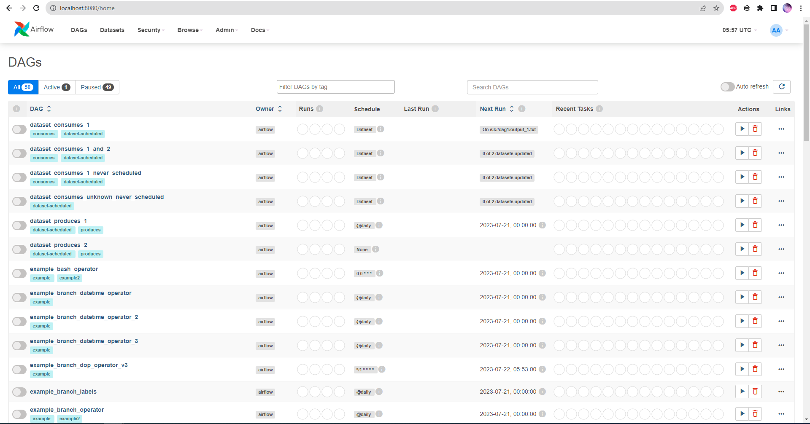
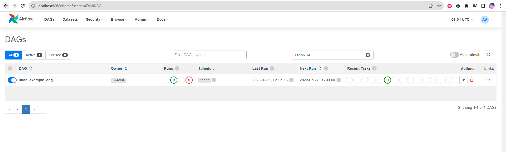
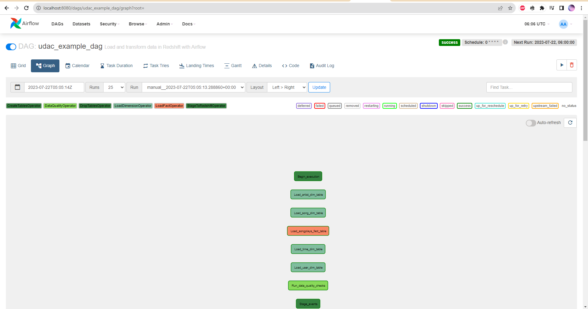
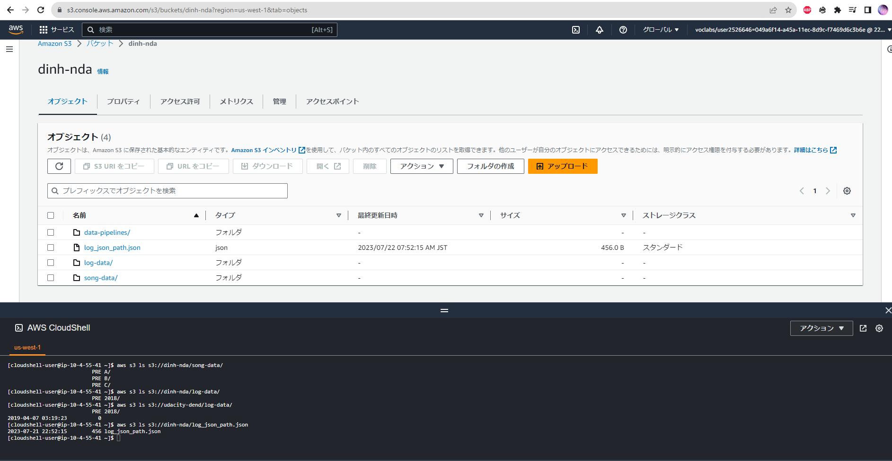
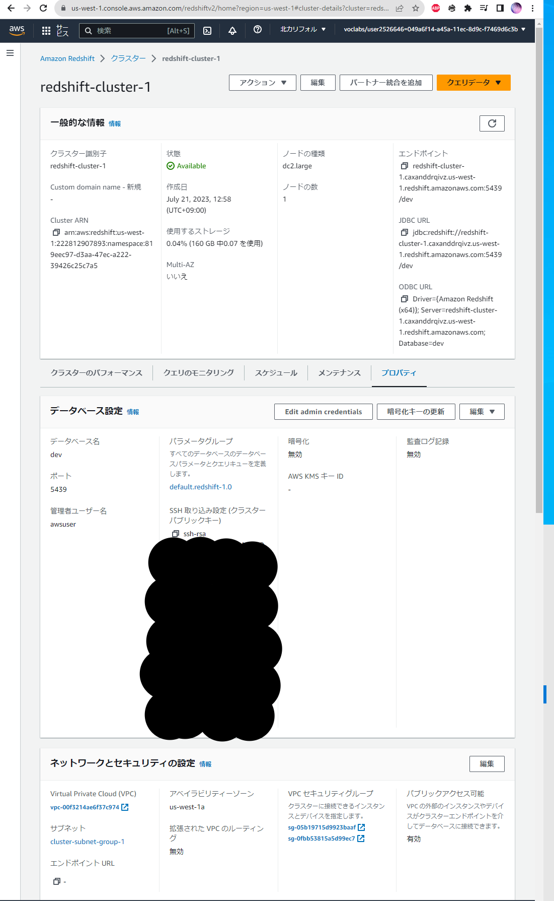
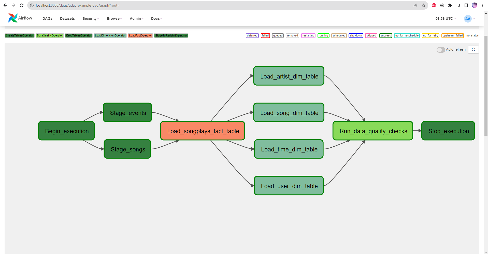
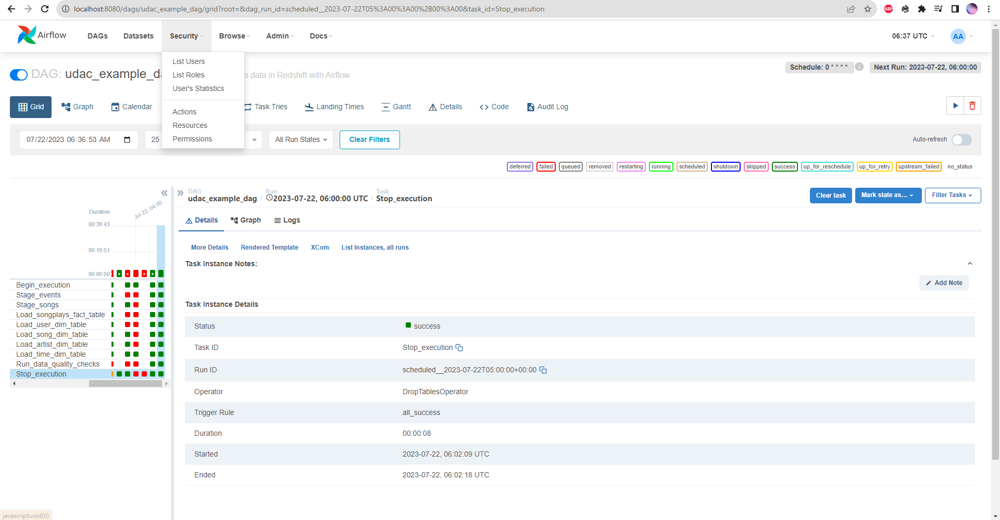

# Project : Data Pipelines with Airflow

Project submission for Udacity Data Engineering Nanodegree - Data Pipelines

## Introduction
A music streaming company, Sparkify, has decided that it is time to introduce more automation and monitoring to their data warehouse ETL pipelines and come to the conclusion that the best tool to achieve this is Apache Airflow.

They have decided to bring you into the project and expect you to create high grade data pipelines that are dynamic and built from reusable tasks, can be monitored, and allow easy backfills. They have also noted that the data quality plays a big part when analyses are executed on top the data warehouse and want to run tests against their datasets after the ETL steps have been executed to catch any discrepancies in the datasets.

The source data resides in S3 and needs to be processed in Sparkify's data warehouse in Amazon Redshift. The source datasets consist of JSON logs that tell about user activity in the application and JSON metadata about the songs the users listen to.

## Datasets

For this project, you'll be working with two datasets. Here are the s3 links for each:

Log data: s3://udacity-dend/log_data  
Song data: s3://udacity-dend/song_data

## Installing Enviroment 

### I. Airflow

1. Install python
	https://www.python.org/downloads/windows/
2. Install pip
	https://phoenixnap.com/kb/install-pip-windows
3. Install airflow by pip
	https://airflow.apache.org/docs/apache-airflow/stable/installation/installing-from-pypi.html
```bash	
pip install "apache-airflow[celery]==2.6.3" --constraint "https://raw.githubusercontent.com/apache/airflow/constraints-2.6.3/constraints-3.7.txt"
```
4. Create folders of project 
		dags, logs, plugins and config
5. Run command to install airflow 
```bash
docker compose up airflow-init
```
6. Run command to start airflow
```bash
docker compose up 
```
8. Access airflow by link: http://localhost:8080 (airflow/airflow)





### II. AWS

1. Create bucket of project and copy data to S3
```bash
# create
aws s3 mb s3://dinh-nda/

# copy to server
aws s3 cp s3://udacity-dend/log-data/ ~/log-data/ --recursive
aws s3 cp s3://udacity-dend/song-data/ ~/song-data/ --recursive
aws s3 cp s3://udacity-dend/log_json_path.json ~/log_json_path.json

# copy to bucket of project
aws s3 cp ~/log-data/ s3://dinh-nda/log-data/ --recursive
aws s3 cp ~/song-data/ s3://dinh-nda/song-data/ --recursive
aws s3 cp ~/log_json_path.json s3://dinh-nda/log_json_path.json

# check data
aws s3 ls s3://dinh-nda/log-data/
aws s3 ls s3://dinh-nda/song-data/
aws s3 ls s3://dinh-nda/log_json_path.json
```


2. Create Redshift by AWS Console


## Implement

### Configuring the DAG
Please refer file [udac_example_dag.py](dags%2Fudac_example_dag.py)
### Building the operators
#### Stage Operator 
Please refer file [stage_redshift.py](dags%2Foperators%2Fstage_redshift.py)
#### Fact and Dimension Operators
Please refer file [load_fact.py](dags%2Foperators%2Fload_fact.py), [load_dimension.py](dags%2Foperators%2Fload_dimension.py)
#### Data Quality Operator
Please refer file [data_quality.py](dags%2Foperators%2Fdata_quality.py)

## Monitoring Airflow

